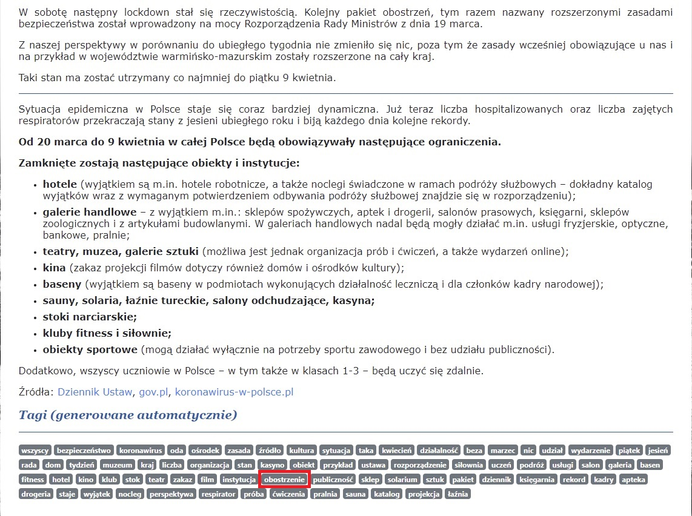

# Auto-tagger
Automatically searching tags for text. Used in the field as a tagger for articles on information webpage for the local community.

The main feature of the app is morphological analysis for sentences which gives us extracted nouns from them.

More information: [morfeusz.sgjp.pl](http://morfeusz.sgjp.pl/doc/about/en)

## Application example

